# Student-Management-Project

## Introduction

I made this project for a my end of year coursework for my second year at Liverpool Hope University.

The technology stack used in the conception and creation of this website have been chosen based on the usability, scope of the project, the time to market, security, and relevance in the market. The technology stack chosen was the MEVN(MongoDB, Express, Vue Js, Nodejs) stack. MEVN is powerful JavaScript software stack. It is a relatively new but can be used to efficiently build front-end components and easier database scalability and management due to NoSQL. The back-end API is based on a hybrid REST + GraphQL model. This was specifically chosen due to the security of the REST API and the ability to avoid over-fetching, the process of requesting more information that is required by the frontend, with GraphQL.

The website’s UI & UX has been specifically designed around the requirements for this client. Thus, ensuring the user experience is extremely smooth and effortless. All major actions such as checking course grades/statistics are easily accessible on the sidebar. Vue Js enables the developer to reuse components with ease thus eliminating the need to recreate similar sections on the website. If used to its maximum potential Vue Js enables data caching and tremendously increases website load speeds. Compared to PHP based architecture Vue Js can respond to user actions in the browser and is lighter which enables it to be faster which is what SEO ranking algorithms consider currently. Meta tags are not as important as website load speeds and accessibility which Vue Js’s excels at.

The website’s back-end uses a hybrid REST API + GraphQL model. The REST API enables security measures such as setting JWTs(Java Web Tokens) which are used to identify and authenticate a user’s identity on the website. GraphQL prevents over-fetching data by requesting only the feels specified by the developer. This is an issue with a standalone REST API as it fetches the entire data payload without any filters which results to over-fetching, especially when multiple collections and documents are required.*

\* Blurb above has been taken directly from my coursework submission.

## Screenshots 
### Landing Page
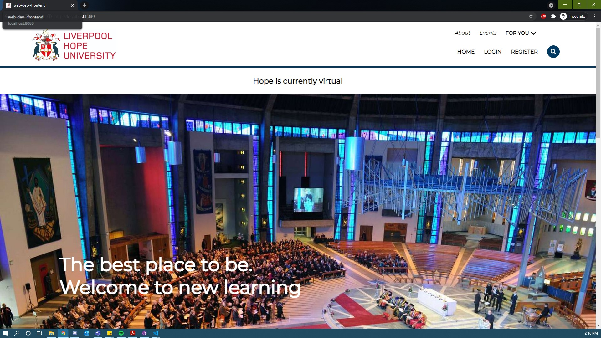

### Landing Page Section 2
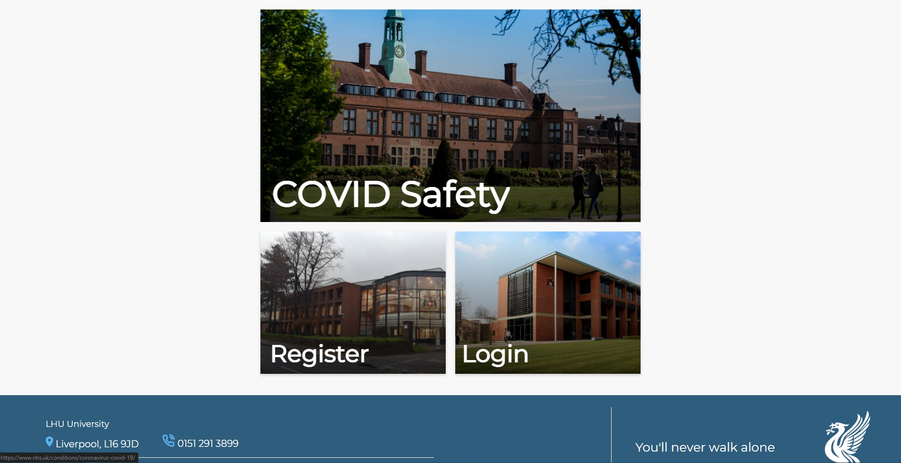

### Login 

### Register
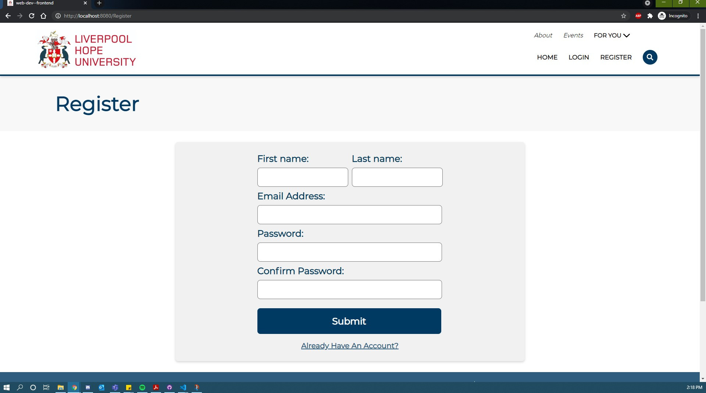

### Student Dashboard
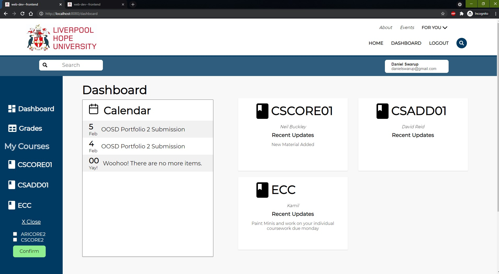

### Student Grades
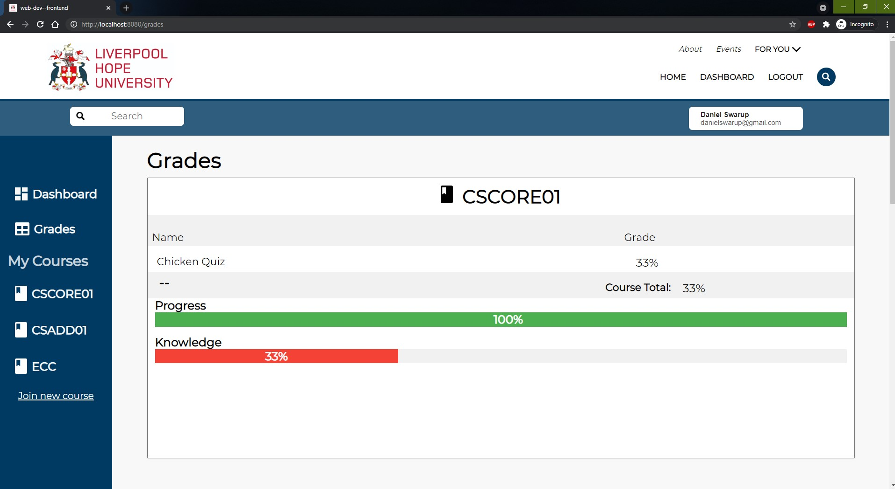

### Student Course
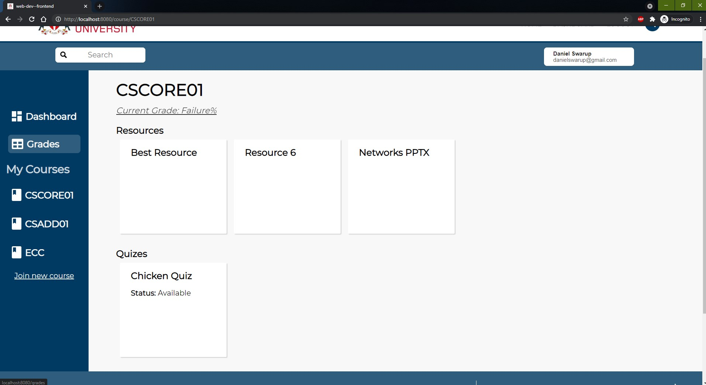

### Student Quiz
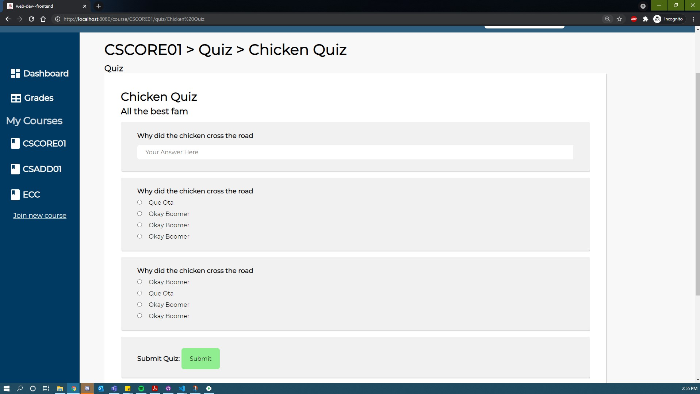

### Staff Dashboard

### Staff Manage Page

### Staff Tutor Approval Widget
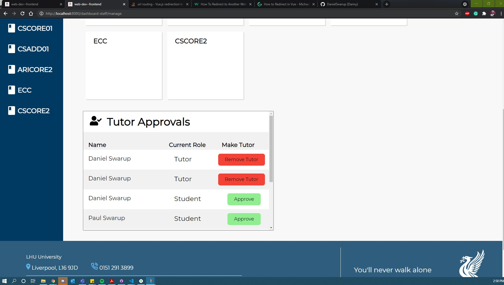

### Staff Course

### Staff Course Approval Widget
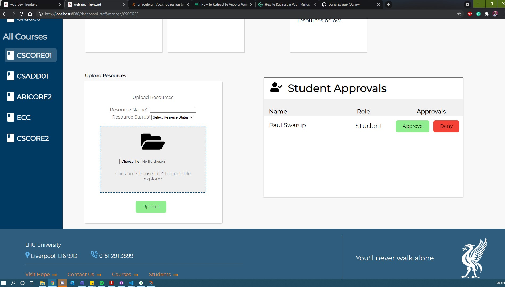

### Staff Quiz Upload Widget
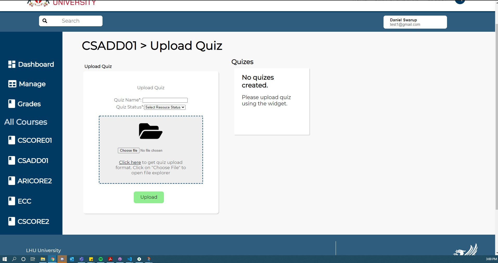

### Staff Grades Overview 
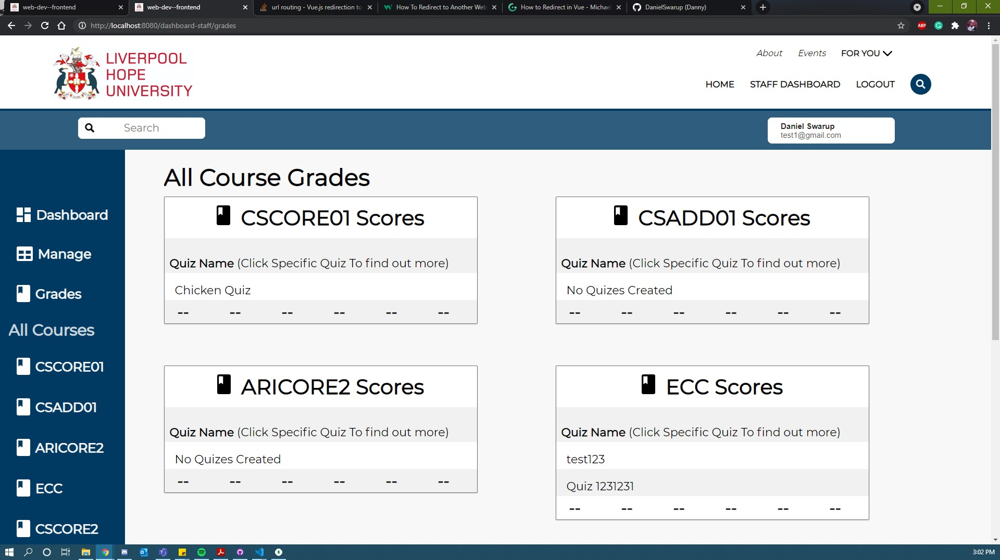

### Staff Individual Grade View
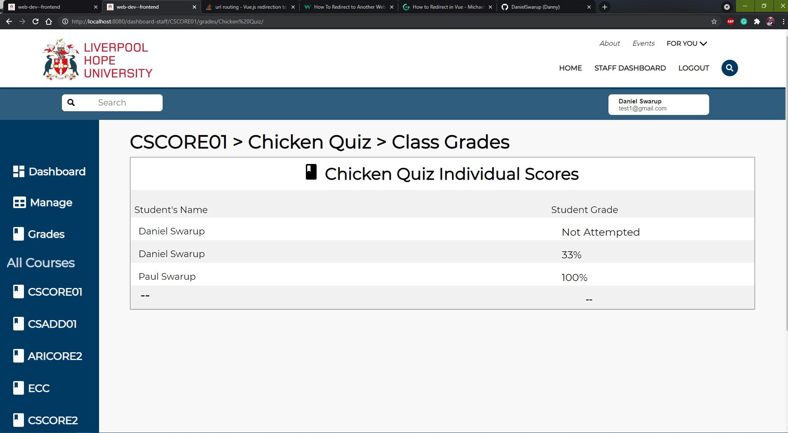

### Staff Enrol students from a master list
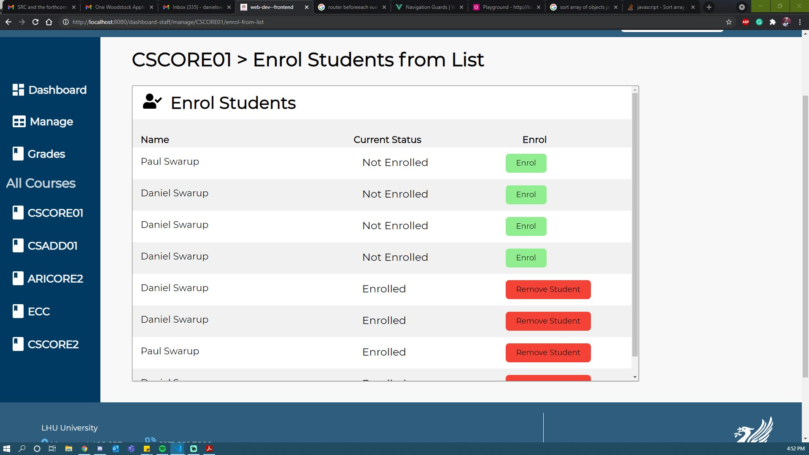
